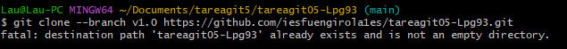

# tareagit05-Lpg93
tareagit05-Lpg93 created by GitHub Classroom

Seguimos los pasos establecidos en la URL
https://www.freecodecamp.org/espanol/news/como-hacer-tu-primer-pull-request-en-github/

 ### 1 Realicemos un fork del repositorio
 


### 2. Clona el repositorio!

Copiamos la URL proporcionada por git hub y efectuamos el clonado


Tras esto entramos dentro del repositorio


### 3. Crea una rama
Creamos una nueva rama con este codigo y le ponemos el nombre de upstream.


### 4. Realiza cambios y confírmalos
Cambiamos el codigo y
Con un git status vemos las modificaciones y añiadimos todo al area de preparacion con el git add .


### 5. Envía los cambios a GitHub
Miramos como se llama el remoto


lo enviamos con este codigo
```
git push origin upstring
```

### 6. Crea un pull request


Aqui pedimos autorizacion para hacer un pull, a lo que el compañero nos lo acepta, modificamos su codigo y efectuamos un push.


### Parte individual


Tras el commit creamos el tag 


Y con este comando clonamos el tag. Aqui indica que no esta vacio el ejercicio ( ya que estoy escribiendo esto) pero lo necesario seria borrar todo con 
```
git rm -rf <carpeta>
```
y volver a descargar.
